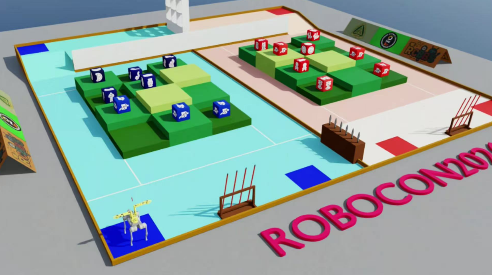
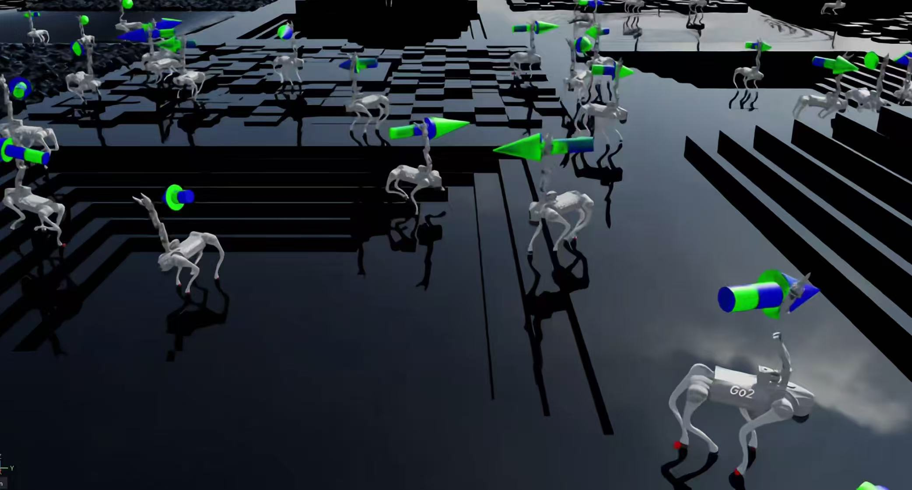
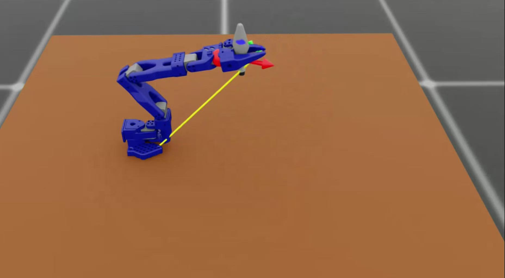
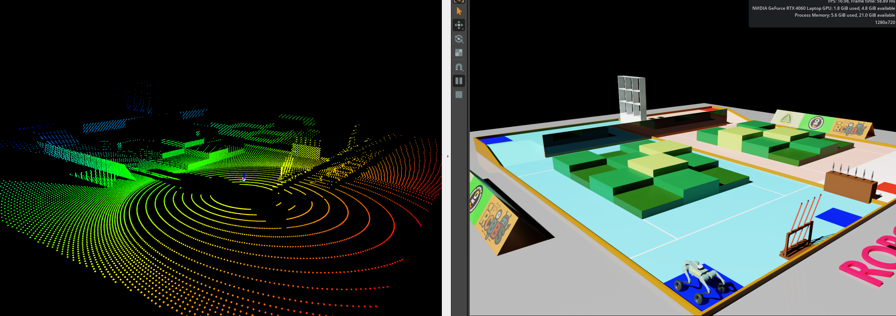
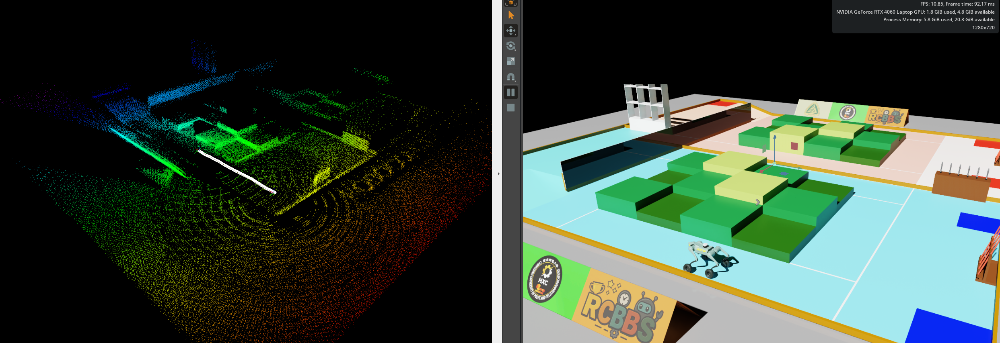

# SIM-SLAM / RC2026_SIM

> ROBOCON 2026 Isaac Lab 仿真、强化学习训练、ROS 2 策略部署与 FAST-LIO2 SLAM 集成示例。
>
> 本仓库当前主体代码来自 `RC2026_SIM`，以 Isaac Lab 外部扩展的形式组织；ROS 2 工作空间用于在 Isaac Sim/Isaac Lab 场景中部署训练策略、接收仿真 IMU / 关节状态 / 点云数据，并接入键盘控制与 FAST-LIO2 建图流程。



## 目录

- [项目能做什么](#项目能做什么)
- [仓库结构](#仓库结构)
- [推荐环境矩阵](#推荐环境矩阵)
- [快速开始：Isaac Lab 仿真与训练](#快速开始isaac-lab-仿真与训练)
- [资源文件 assets 的放置方式](#资源文件-assets-的放置方式)
- [常用任务与命令](#常用任务与命令)
- [ROS 2 Humble 安装与 ros2_ws 构建](#ros-2-humble-安装与-ros2_ws-构建)
- [FAST-LIO2 / Livox ROS Driver 2 安装教程](#fast-lio2--livox-ros-driver-2-安装教程)
- [能否把 ROS 2 直接装进 Conda？](#能否把-ros-2-直接装进-conda)
- [代理配置：7890 端口](#代理配置7890-端口)
- [常见问题排查](#常见问题排查)
- [参考资料](#参考资料)

## 项目能做什么

本项目围绕 ROBOCON 2026 机器人仿真与 SLAM 部署流程，包含四类内容：

1. **Isaac Lab 外部扩展**
   - 扩展路径：`source/Robocon2026/`
   - Python 包名：`Robocon2026`
   - 基于 Isaac Lab Manager-Based RL 环境注册任务。
2. **仿真资产与地图**
   - 代码中默认从仓库根目录的 `assets/` 读取 USD、HDR、材质、PCD 等文件。
   - `assets/Simulation/sim.usd` 可作为 ROS 2 联调场景入口。
3. **强化学习训练与回放**
   - `scripts/rsl_rl/train.py` / `scripts/rsl_rl/play.py`
   - 内置本地 `rsl_rl` 代码，方便与 Isaac Lab 任务配置配套使用。
4. **ROS 2 策略部署与 SLAM**
   - `ros2_ws/src/deploy_policy`：读取 TorchScript 策略，订阅仿真状态，发布关节命令。
   - `ros2_ws/src/FAST_LIO` 与 `ros2_ws/src/livox_ros_driver2`：作为子模块接入 FAST-LIO2 与 Livox 驱动。

项目中已有的主要任务包括：

| 类别 | 任务 ID | 说明 |
| --- | --- | --- |
| SO-Arm101 夹取 | `Template-Arm-Control-Lift-v0` / `Template-Arm-Control-Lift-Play-v0` | 机械臂夹取并抬升物体 |
| SO-Arm101 视觉蒸馏/微调 | `Template-Arm-Control-Lift-Distillation-Vision-v0` 等 | 视觉输入策略相关实验 |
| 武器组装参考任务 | `Template-Assemble-Weapon-Dual-v0` / `Template-Assemble-Weapon-Single-v0` | 当前 README 中作为参考，建议先用 dummy agent 验证 |
| Unitree Go2 | `Template-Basic-Control-Flat-GO2-v0` / `Rough-GO2-v0` | 四足基础步态控制 |
| Unitree Go2W | `Template-Basic-Control-Flat-GO2W-v0` / `Rough-GO2W-v0` | 轮足基础控制 |
| ArmDog | `Template-Basic-Control-Flat-ArmDog-v0` / `Rough-ArmDog-v0` | Go2W + SO-Arm101 组合机器人 |
| ROBOCON 2026 场景 | `Template-Robocon2026-v0` | 面向整图仿真的综合环境 |

## 仓库结构

```text
.
├── README.md
├── README.assets/                      # README 图片
├── assets/                             # 大体积仿真资产；默认不建议提交 Git
│   ├── ArmDog/ Go2/ Go2W/ SO101/ ...
│   ├── Map/
│   ├── Materials/
│   ├── PCD/map.pcd
│   └── Simulation/sim.usd
├── scripts/
│   ├── list_envs.py                    # 列出已注册 Isaac Lab 任务
│   ├── zero_agent.py                   # 零动作 agent，验证环境配置
│   ├── random_agent.py                 # 随机动作 agent，验证环境配置
│   ├── rsl_rl/train.py                 # 训练入口
│   ├── rsl_rl/play.py                  # 回放入口
│   └── test_core/                      # 场景 / 核心仿真测试脚本
├── source/Robocon2026/
│   ├── setup.py
│   ├── config/extension.toml
│   └── Robocon2026/
│       ├── robots/                     # Go2、Go2W、ArmDog、SO101、Jetbot 等资产配置
│       ├── map/                        # KFS / terrain 场景配置
│       └── tasks/manager_based/        # Isaac Lab ManagerBasedRLEnv 任务
└── ros2_ws/
    └── src/
        ├── deploy_policy/              # ROS 2 策略部署包
        ├── FAST_LIO/                   # FAST-LIO2 ROS 2 子模块
        └── livox_ros_driver2/          # Livox ROS Driver 2 子模块
```

> 注意：`assets/` 通常超过 1GB，且包含 USD / PCD / HDR / 材质等二进制资产。建议通过网盘或 Git LFS/对象存储分发，不建议直接放入普通 Git 仓库。

## 推荐环境矩阵

| 组件 | 推荐版本 | 说明 |
| --- | --- | --- |
| OS | Ubuntu 22.04 LTS | ROS 2 Humble、Livox ROS Driver 2、FAST-LIO2 ROS 2 fork 的社区组合最常见 |
| GPU | NVIDIA RTX 系列，显存建议 8GB+ | Isaac Sim / Isaac Lab 对驱动与显卡要求较高；训练建议更高显存 |
| NVIDIA Driver | 按 Isaac Sim 官方版本矩阵安装 | 不要只按 PyTorch 版本倒推驱动；优先参考 Isaac Sim 文档 |
| Isaac Sim / Isaac Lab | Isaac Sim 4.5 / 5.x + Isaac Lab 对应版本 | 本仓库 `setup.py` 标注 Python `>=3.10`，classifier 包含 Isaac Sim 4.5 / 5.0 |
| Python | 3.10 或 3.11 | 取决于你安装的 Isaac Lab / Isaac Sim 版本；不要混用多个 Python 解释器 |
| ROS 2 | Humble Hawksbill | Humble 官方 apt 包面向 Ubuntu 22.04 |
| FAST-LIO2 | ROS 2 fork | 子模块指向 `Kuriharamio/FAST_LIO` 的 `ROS2` 分支 |
| Livox 驱动 | Livox ROS Driver 2 | Humble 下使用 `./build.sh humble` |

**建议原则：**

- Isaac Lab 训练环境和 ROS 2 部署环境可以放在同一台机器，但最好分成两个 shell 使用：
  - Isaac shell：`conda activate env_isaaclab`
  - ROS shell：`source /opt/ros/humble/setup.zsh && source ros2_ws/install/setup.zsh`
- 不建议在同一个 shell 里同时激活 Isaac 的 Conda 环境和系统 apt 安装的 ROS 2，除非你非常清楚 `PATH` / `PYTHONPATH` / `LD_LIBRARY_PATH` 的优先级。

## 快速开始：Isaac Lab 仿真与训练

以下流程假设你使用 Ubuntu 22.04，并且已经安装好 NVIDIA 驱动。

### 1. 获取仓库和子模块

```bash
# 如需代理，请先见“代理配置：7890 端口”章节

git clone --recursive https://github.com/sjtumrgx/SIM-SLAM.git
cd SIM-SLAM

# 如果 clone 时没有加 --recursive，后续补执行：
git submodule update --init --recursive
```

### 2. 安装 Isaac Lab

Isaac Lab 安装方式变化较快，建议优先跟随官方文档。社区中最稳妥的做法是：**让 Isaac Lab 拥有自己的 Python/Conda 环境，本仓库作为外部扩展以 editable 模式安装进去**。

示例流程：

```bash
# 仅示例：具体 Python 版本以你使用的 Isaac Lab 文档为准
conda create -n env_isaaclab python=3.11 -y
conda activate env_isaaclab
python -m pip install --upgrade pip

# 安装 Isaac Lab：请按官方文档选择源码安装或 pip 安装
# 源码方式常见流程示例：
git clone https://github.com/isaac-sim/IsaacLab.git ~/IsaacLab
cd ~/IsaacLab
./isaaclab.sh --install rsl_rl

# 验证 Isaac Lab
./isaaclab.sh -p scripts/tutorials/00_sim/create_empty.py
```

如果你使用的是 Isaac Sim App / Conda 方式，也可以用 Isaac Lab 提供的 `isaaclab.sh -p` 调用正确 Python。核心目标是：后续运行本仓库脚本时，`python -c "import isaaclab"` 能成功。

### 3. 安装本仓库 Isaac Lab 扩展

```bash
cd /path/to/SIM-SLAM
conda activate env_isaaclab

# 安装 Robocon2026 扩展
python -m pip install -e source/Robocon2026

# 验证任务注册
python scripts/list_envs.py
```

成功后，你应能看到类似下面的任务列表：

```text
Template-Arm-Control-Lift-v0
Template-Arm-Control-Lift-Play-v0
Template-Basic-Control-Flat-GO2W-v0
Template-Basic-Control-Rough-GO2W-v0
Template-Basic-Control-Flat-GO2-v0
Template-Basic-Control-Rough-GO2-v0
Template-Basic-Control-Flat-ArmDog-v0
Template-Basic-Control-Rough-ArmDog-v0
...
```

### 4. VS Code 代码提示

仓库继承了 Isaac Lab 模板中的 VS Code 任务：

1. 打开 VS Code。
2. `Ctrl + Shift + P`。
3. 选择 `Tasks: Run Task`。
4. 选择 `setup_python_env`。
5. 按提示输入 Isaac Sim / Isaac Lab 安装路径。

成功后会生成 `.vscode/.python.env`，用于补全 Omniverse / Isaac Sim 扩展模块路径。

## 资源文件 assets 的放置方式

当前代码多处以相对路径读取资产，例如：

- `assets/Go2/go2.usd`
- `assets/Go2W/go2w.usd`
- `assets/ArmDog/armdog.usd`
- `assets/SO101/so101.usd`
- `assets/Map/robocon2026.usd`
- `assets/Simulation/sim.usd`
- `assets/PCD/map.pcd`

请将资产解压到仓库根目录的 `assets/` 下：

```text
SIM-SLAM/
├── assets/
│   ├── Go2/
│   ├── Go2W/
│   ├── ArmDog/
│   ├── SO101/
│   ├── Map/
│   └── Simulation/
└── source/
```

资产下载：

```text
百度网盘：
链接: https://pan.baidu.com/s/192W4uDKmPrswztege8Sm-A?pwd=5iff
提取码: 5iff
```

如果出现 `Could not open asset @assets/...@`、模型不可见、材质缺失等问题，优先检查：

```bash
pwd                         # 必须在仓库根目录运行脚本
ls assets/Go2/go2.usd
ls assets/Simulation/sim.usd
```

## 常用任务与命令

### 列出任务

```bash
conda activate env_isaaclab
cd /path/to/SIM-SLAM
python scripts/list_envs.py
```

### 用 dummy agent 验证环境

推荐先用零动作或随机动作验证资产、任务注册、仿真启动是否正常：

```bash
python scripts/zero_agent.py --task Template-Basic-Control-Flat-GO2W-Play-v0
python scripts/random_agent.py --task Template-Basic-Control-Flat-GO2W-Play-v0
```

### 训练策略

```bash
python scripts/rsl_rl/train.py --task Template-Basic-Control-Flat-GO2W-v0
```

常用建议：

```bash
# 无 GUI/headless 训练，适合服务器
python scripts/rsl_rl/train.py --task Template-Basic-Control-Flat-GO2W-v0 --headless

# 指定随机种子，便于复现实验
python scripts/rsl_rl/train.py --task Template-Basic-Control-Flat-GO2W-v0 --seed 42
```

### 回放策略

```bash
python scripts/rsl_rl/play.py --task Template-Basic-Control-Flat-GO2W-Play-v0 \
  --checkpoint /path/to/model.pt
```

### 测试完整场景

```bash
python scripts/test_core/setup_scene.py
```





## ROS 2 Humble 安装与 ros2_ws 构建

ROS 2 部分用于策略部署、键盘控制和 SLAM。它不是训练 Isaac Lab 任务的必要条件。

### 1. 推荐安装方式：apt 安装到 `/opt/ros/humble`

ROS 2 Humble 官方二进制包面向 Ubuntu 22.04。推荐使用 apt 安装，因为依赖解析、colcon、rosdep 与大量 C++ 包兼容性最好。

```bash
# 1) locale
locale
sudo apt update
sudo apt install locales -y
sudo locale-gen en_US en_US.UTF-8
sudo update-locale LC_ALL=en_US.UTF-8 LANG=en_US.UTF-8
export LANG=en_US.UTF-8

# 2) 添加 universe 与 ROS 2 apt source
sudo apt install software-properties-common curl -y
sudo add-apt-repository universe -y
sudo apt update

export ROS_APT_SOURCE_VERSION=$(curl -s https://api.github.com/repos/ros-infrastructure/ros-apt-source/releases/latest | grep -F "tag_name" | awk -F'"' '{print $4}')
curl -L -o /tmp/ros2-apt-source.deb \
  "https://github.com/ros-infrastructure/ros-apt-source/releases/download/${ROS_APT_SOURCE_VERSION}/ros2-apt-source_${ROS_APT_SOURCE_VERSION}.$(. /etc/os-release && echo ${UBUNTU_CODENAME:-${VERSION_CODENAME}})_all.deb"
sudo dpkg -i /tmp/ros2-apt-source.deb

# 3) 安装 ROS 2 Humble + 开发工具
sudo apt update
sudo apt upgrade -y
sudo apt install ros-humble-desktop ros-dev-tools \
  python3-colcon-common-extensions python3-rosdep python3-vcstool \
  ros-humble-teleop-twist-keyboard -y

# 4) rosdep 初始化
sudo rosdep init 2>/dev/null || true
rosdep update

# 5) 每次使用 ROS 2 的 shell 里 source，不建议无脑写入全局 .zshrc/.bashrc
source /opt/ros/humble/setup.zsh   # zsh
# source /opt/ros/humble/setup.bash  # bash

# 6) 验证
ros2 run demo_nodes_cpp talker
# 另开终端：source /opt/ros/humble/setup.zsh && ros2 run demo_nodes_py listener
```

> 如果你使用 bash，把上面所有 `setup.zsh` 换成 `setup.bash`。

### 2. 构建本仓库 ros2_ws

```bash
cd /path/to/SIM-SLAM/ros2_ws
source /opt/ros/humble/setup.zsh

# 初始化子模块；如果目录为空，必须执行
cd /path/to/SIM-SLAM
git submodule update --init --recursive

cd ros2_ws
rosdep install --from-paths src --ignore-src -r -y
colcon build --symlink-install --packages-select deploy_policy
source install/setup.zsh
```

### 3. 启动策略控制器

当前 `deploy_policy` 包中包含 Go2W、Go2、ArmDog 控制脚本与 launch 文件。常用入口：

```bash
cd /path/to/SIM-SLAM/ros2_ws
source /opt/ros/humble/setup.zsh
source install/setup.zsh

# Go2W，默认加载 policy/go2w/rough/exported/policy.pt
ros2 launch deploy_policy go2w_controller.launch.py use_sim_time:=true

# 指定策略路径
ros2 launch deploy_policy go2w_controller.launch.py \
  use_sim_time:=true \
  policy_path:=/absolute/path/to/policy.pt

# 键盘控制 cmd_vel
ros2 run teleop_twist_keyboard teleop_twist_keyboard
```

仿真侧建议打开 `assets/Simulation/sim.usd`，确保 Isaac Sim / ROS 2 Bridge 正在发布这些主题：

```bash
ros2 topic list
ros2 topic echo /joint_states --once
ros2 topic echo /imu --once
ros2 topic echo /cmd_vel --once
```

`deploy_policy` 控制器主要使用：

| Topic | 类型 | 方向 | 说明 |
| --- | --- | --- | --- |
| `/cmd_vel` | `geometry_msgs/msg/Twist` | 订阅 | 键盘或导航速度指令 |
| `/joint_states` | `sensor_msgs/msg/JointState` | 订阅 | 仿真机器人关节状态 |
| `/imu` | `sensor_msgs/msg/Imu` | 订阅 | 仿真 IMU |
| `/joint_command` | `sensor_msgs/msg/JointState` | 发布 | 策略输出关节命令 |

ArmDog 控制器会根据 `dog_type` 参数使用带后缀的 topic，例如 `joint_command_<dog_type>`、`imu_<dog_type>`、`joint_states_<dog_type>`。

## FAST-LIO2 / Livox ROS Driver 2 安装教程

FAST-LIO2 建图需要 LiDAR 点云与 IMU 时间同步。真实 Livox 雷达一般需要 `Livox-SDK2` + `livox_ros_driver2`；Isaac 仿真点云则需要确保消息类型、时间戳字段与 FAST-LIO2 配置匹配。

### 0. 总体构建顺序

推荐顺序如下：

1. 安装 ROS 2 Humble。
2. 安装 PCL / Eigen / Ceres 等依赖。
3. 安装 Livox-SDK2。
4. 构建 livox_ros_driver2。
5. 构建 FAST-LIO2 ROS 2 fork。
6. 修改 FAST-LIO2 config 中的 `lid_topic`、`imu_topic`、外参、时间同步参数。
7. 启动驱动 / 播包 / 仿真，再启动 `fast_lio`。

### 1. 安装基础依赖

```bash
sudo apt update
sudo apt install -y \
  build-essential cmake git \
  libeigen3-dev libpcl-dev libceres-dev \
  libyaml-cpp-dev libboost-all-dev
```

FAST-LIO2 ROS 2 fork 的 README 说明：Ubuntu >= 20.04、ROS >= Foxy，推荐 Humble；默认 apt 的 PCL 与 Eigen 通常足够使用。

### 2. 安装 Livox-SDK2

```bash
cd ~/Downloads
git clone https://github.com/Livox-SDK/Livox-SDK2.git
cd Livox-SDK2
mkdir -p build && cd build
cmake ..
make -j$(nproc)
sudo make install
sudo ldconfig
```

默认会安装库到 `/usr/local/lib`、头文件到 `/usr/local/include`。

### 3. 初始化本仓库子模块

```bash
cd /path/to/SIM-SLAM
git submodule update --init --recursive

# 检查目录不为空
ls ros2_ws/src/FAST_LIO
ls ros2_ws/src/livox_ros_driver2
```

本仓库 `.gitmodules` 中的默认来源：

```text
ros2_ws/src/FAST_LIO          -> https://github.com/Kuriharamio/FAST_LIO.git, branch ROS2
ros2_ws/src/livox_ros_driver2 -> https://github.com/Ericsii/livox_ros_driver2.git
```

如果你的网络环境无法拉取子模块，可以手动克隆：

```bash
cd /path/to/SIM-SLAM/ros2_ws/src
rm -rf FAST_LIO livox_ros_driver2

git clone -b ROS2 https://github.com/Kuriharamio/FAST_LIO.git FAST_LIO
git clone https://github.com/Ericsii/livox_ros_driver2.git livox_ros_driver2
```

### 4. 构建 Livox ROS Driver 2

Livox 官方推荐在 ROS 2 Humble 下执行 `./build.sh humble`：

```bash
cd /path/to/SIM-SLAM/ros2_ws/src/livox_ros_driver2
source /opt/ros/humble/setup.zsh
./build.sh humble

# build.sh 通常会在上级 workspace 生成 install；回到 ros2_ws 后 source
cd /path/to/SIM-SLAM/ros2_ws
source install/setup.zsh
ros2 pkg list | grep livox
```

常用 Livox 启动示例：

```bash
# MID-360，自定义 Livox CustomMsg，适合 FAST-LIO2 需要逐点时间戳的场景
ros2 launch livox_ros_driver2 msg_MID360_launch.py

# RViz 观察 PointCloud2
ros2 launch livox_ros_driver2 rviz_MID360_launch.py
```

> FAST-LIO2 对运动畸变校正依赖每个点的时间戳。Livox 场景优先使用发布 `livox_ros_driver2/CustomMsg` 的 `msg_*` launch，而不是只发布普通 `PointCloud2` 的 launch。

### 5. 构建 FAST-LIO2

```bash
cd /path/to/SIM-SLAM/ros2_ws
source /opt/ros/humble/setup.zsh
source install/setup.zsh 2>/dev/null || true   # 如果已构建 livox_ros_driver2，先 source

rosdep install --from-paths src --ignore-src -r -y
colcon build --symlink-install --packages-select fast_lio
source install/setup.zsh
```

如果 `--packages-select fast_lio` 找不到包，先检查：

```bash
colcon list | grep -i lio
find src/FAST_LIO -maxdepth 2 -name package.xml -print
```

### 6. 配置并运行 FAST-LIO2

FAST-LIO2 ROS 2 fork 的通用启动方式：

```bash
cd /path/to/SIM-SLAM/ros2_ws
source /opt/ros/humble/setup.zsh
source install/setup.zsh

ros2 launch fast_lio mapping.launch.py config_file:=VLS.yaml
```

若使用 Livox MID-360，可先启动驱动：

```bash
ros2 launch livox_ros_driver2 msg_MID360_launch.py
```

若使用 Isaac Sim 仿真点云，请重点检查 `FAST_LIO/config/*.yaml` 中这些项：

| 参数 | 建议检查内容 |
| --- | --- |
| `lid_topic` | 是否等于 Isaac / Livox 发布的点云 topic |
| `imu_topic` | 是否等于仿真或真实 IMU topic |
| `extrinsic_T` / `extrinsic_R` | LiDAR 在 IMU 坐标系下的位置与旋转；外参已知时建议关闭在线估计 |
| `time_sync_en` | 只有在没有硬件同步且可接受软件同步误差时才开启 |
| `pcd_save_enable` | 需要保存全局点云时设为 `1` |
| `scan_line` / `timestamp_unit` | Velodyne / Ouster / 自定义 PointCloud2 需要按雷达实际字段设置 |

常见运行顺序：

```bash
# 终端 A：启动 Isaac Sim 场景或真实 Livox driver
ros2 topic list

# 终端 B：启动 FAST-LIO2
source /opt/ros/humble/setup.zsh
source /path/to/SIM-SLAM/ros2_ws/install/setup.zsh
ros2 launch fast_lio mapping.launch.py config_file:=VLS.yaml

# 终端 C：观察输出
rviz2
ros2 topic list | grep -E 'lio|cloud|path|odom|map'
```





### 7. FAST-LIO2 调参经验

- **先保证时间戳正确，再调外参。** 如果出现 `Failed to find match for field 'time'`，通常说明点云消息缺少 FAST-LIO2 需要的逐点时间字段。
- **Livox 优先使用 CustomMsg。** 普通 `PointCloud2` 可能没有足够的逐点时间信息，运动时地图会糊。
- **外参已知时不要在线估计。** 将 `extrinsic_est_en` 设为 false/0，减少初始化不稳定。
- **仿真里也要检查 frame。** `lidar`、`imu`、`base_link`、`map` 的 tf 命名和 FAST-LIO 配置必须一致。
- **PCD 保存只在需要时开启。** 长时间运行会生成大文件。
- **真实雷达注意网络。** Livox 雷达需要正确 IP、网卡、组播/防火墙配置。

## 能否把 ROS 2 直接装进 Conda？

简短回答：**可以通过 RoboStack 等社区方案把 ROS 2 装进 Conda，但本项目更推荐 ROS 2 Humble 使用系统 apt 安装到 `/opt/ros/humble`，并把 Isaac Lab 的 Conda 环境与 ROS shell 分开。**

### 为什么不推荐把 apt ROS 2 和 Conda 混在一起？

ROS 2 官方文档明确指出：在 Linux 上混用 apt 安装的 ROS 2 与 Conda 安装的 Python 包通常会冲突，尤其是 `PATH`、`PYTHONPATH`、C 扩展 ABI、Qt / OpenCV / PCL / DDS 等库。典型现象包括：

- `import rclpy` 找到错误 Python 版本的 `.so`；
- `colcon build` 找到 Conda 的 CMake / Python / NumPy，导致编译失败；
- RViz / Qt / OpenCV 动态库冲突；
- Isaac Lab 的 PyTorch / CUDA 栈与 ROS Python 栈互相污染。

### 推荐方案对比

| 方案 | 是否影响系统环境 | 推荐程度 | 适用场景 |
| --- | --- | --- | --- |
| apt 安装 ROS 2 到 `/opt/ros/humble` | 会添加 apt source 与系统包，但 ROS 文件集中在 `/opt/ros/humble` | ⭐⭐⭐⭐⭐ | 本项目推荐；与 FAST-LIO2 / Livox / PCL / Eigen 兼容性最好 |
| Docker / Dev Container | 基本不影响宿主系统 | ⭐⭐⭐⭐ | 需要强隔离、CI、多人统一环境；GUI/USB/GPU 配置更复杂 |
| RoboStack / Conda ROS 2 | Conda 环境内隔离，不改系统 ROS | ⭐⭐⭐ | 纯 ROS 学习、无 sudo、macOS/Windows/多版本测试 |
| 在 Isaac Conda 里再装 ROS 2 | 理论可试，实践不推荐 | ⭐ | 容易污染 Isaac Lab、PyTorch、CUDA、PCL、Qt 依赖 |

### 如果必须使用 Conda ROS 2

可以参考 RoboStack：

```bash
# 不要装到 base，也不要和 env_isaaclab 混用
conda create -n ros_humble -c conda-forge -c robostack-humble ros-humble-desktop
conda activate ros_humble
conda config --env --add channels robostack-humble

# 不要再 source /opt/ros/humble/setup.zsh
rviz2
```

但对本项目的建议是：

- `env_isaaclab` 只运行 Isaac Lab 训练/仿真脚本。
- `/opt/ros/humble` shell 只运行 `ros2_ws`、`deploy_policy`、FAST-LIO2。
- 不要把 `source /opt/ros/humble/setup.*` 写进会自动影响所有终端的全局配置；可以写一个显式脚本：

```bash
# scripts/source_ros2_humble.zsh，自行创建
source /opt/ros/humble/setup.zsh
source /path/to/SIM-SLAM/ros2_ws/install/setup.zsh
```

这样不会在打开 Conda/Isaac 终端时自动污染环境。

## 代理配置：7890 端口

如果你使用本机代理端口 `7890`，常用配置如下。

### 临时代理

```bash
export http_proxy=http://127.0.0.1:7890
export https_proxy=http://127.0.0.1:7890
export HTTP_PROXY=http://127.0.0.1:7890
export HTTPS_PROXY=http://127.0.0.1:7890
export all_proxy=socks5://127.0.0.1:7890
export ALL_PROXY=socks5://127.0.0.1:7890
```

### Git 代理

```bash
git config --global http.proxy http://127.0.0.1:7890
git config --global https.proxy http://127.0.0.1:7890

# 取消代理
# git config --global --unset http.proxy
# git config --global --unset https.proxy
```

### apt 代理（可选）

只在确实需要时使用：

```bash
sudo tee /etc/apt/apt.conf.d/99proxy >/dev/null <<'APT_PROXY'
Acquire::http::Proxy "http://127.0.0.1:7890";
Acquire::https::Proxy "http://127.0.0.1:7890";
APT_PROXY

# 取消：sudo rm /etc/apt/apt.conf.d/99proxy
```

## 常见问题排查

### `ModuleNotFoundError: No module named 'isaaclab'`

说明当前 Python 不是 Isaac Lab 环境：

```bash
which python
python -c "import isaaclab; print(isaaclab.__file__)"
```

解决：激活 `env_isaaclab`，或使用 Isaac Lab 的 `./isaaclab.sh -p` 运行脚本。

### `ModuleNotFoundError: No module named 'Robocon2026'`

没有安装本仓库扩展：

```bash
cd /path/to/SIM-SLAM
python -m pip install -e source/Robocon2026
```

### 任务列表为空或找不到 `Template-*`

检查：

```bash
python scripts/list_envs.py
python -c "import Robocon2026, gymnasium as gym; print(Robocon2026.__file__)"
```

如果你改了任务命名，需要同步修改 `scripts/list_envs.py` 的过滤条件。

### 资产缺失 / 场景黑屏 / USD 无法打开

确认在仓库根目录运行，并且 `assets/` 已解压：

```bash
pwd
find assets -maxdepth 2 -type f | head
```

### ROS 2 `ros2: command not found`

当前 shell 没有 source：

```bash
source /opt/ros/humble/setup.zsh
ros2 --help
```

### `colcon build` 找到 Conda Python 导致失败

退出 Conda 后重新构建：

```bash
conda deactivate 2>/dev/null || true
source /opt/ros/humble/setup.zsh
cd /path/to/SIM-SLAM/ros2_ws
rm -rf build install log
colcon build --symlink-install
```

### ROS 2 topic 互相看不到

检查 DDS 域和组播：

```bash
echo $ROS_DOMAIN_ID
ros2 multicast receive
# 另开终端：ros2 multicast send
```

多机或多队伍同网段时，建议设置不同 `ROS_DOMAIN_ID`。

### FAST-LIO2 报 `Failed to find match for field 'time'`

通常是点云缺少逐点时间戳。Livox 请使用发布 `livox_ros_driver2/CustomMsg` 的 `msg_*` launch；自定义仿真点云请确认字段和 FAST-LIO2 配置匹配。

### 地图漂移或快速发散

按优先级检查：

1. LiDAR / IMU 时间同步；
2. `lid_topic` / `imu_topic` 是否正确；
3. LiDAR-IMU 外参；
4. IMU 方向和重力方向；
5. 点云时间单位与 `timestamp_unit`；
6. 仿真频率和 ROS 2 `/clock` 是否稳定。

## 代码格式与提交建议

```bash
pip install pre-commit
pre-commit run --all-files
```

大文件建议：

- README 图片可以保留在 `README.assets/`。
- `assets/`、训练输出、日志、PCD、rosbag 不建议直接提交普通 Git。
- 策略文件 `.pt` 如果很小可跟随仓库；大模型建议 Git LFS 或 Release 附件。

## 致谢

- Isaac Lab / Isaac Sim 项目模板与强化学习接口。
- 重庆邮电大学 HXC 战队在 rcbbs 分享的 ROBOCON 2026 相关模型资产。
- HKU-MARS FAST-LIO / FAST-LIO2 与 ROS 2 社区维护者。
- Livox SDK2 与 Livox ROS Driver 2。

## 参考资料

- Isaac Lab Installation: <https://isaac-sim.github.io/IsaacLab/main/source/setup/installation/index.html>
- Isaac Lab Pip Installation: <https://isaac-sim.github.io/IsaacLab/main/source/setup/installation/pip_installation.html>
- ROS 2 Humble Ubuntu deb packages: <https://docs.ros.org/en/humble/Installation/Ubuntu-Install-Debs.html>
- ROS 2 installation troubleshooting / Conda conflict: <https://docs.ros.org/en/humble/How-To-Guides/Installation-Troubleshooting.html>
- RoboStack Getting Started: <https://robostack.github.io/GettingStarted.html>
- FAST-LIO2 ROS 2 fork used by this project: <https://github.com/Kuriharamio/FAST_LIO/tree/ROS2>
- FAST-LIO upstream: <https://github.com/hku-mars/FAST_LIO>
- Livox ROS Driver 2: <https://github.com/Livox-SDK/livox_ros_driver2>
- Livox-SDK2: <https://github.com/Livox-SDK/Livox-SDK2>
